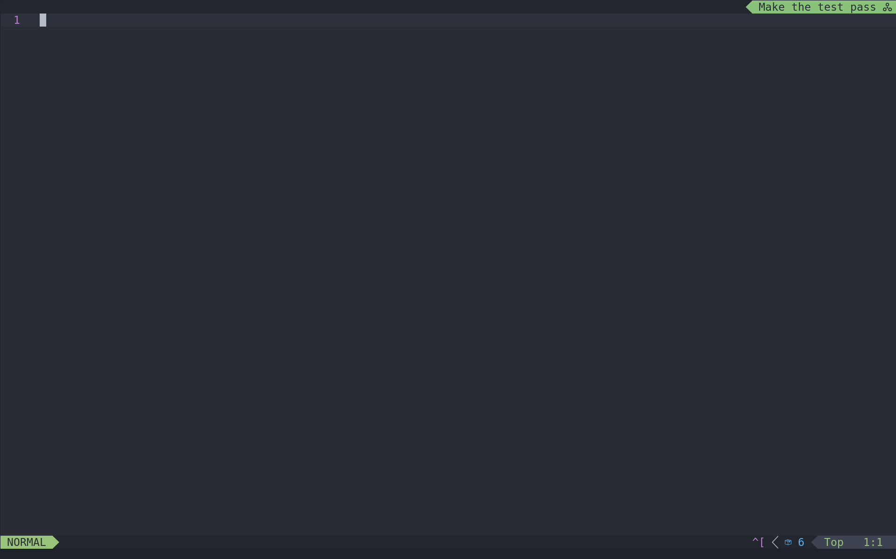

# nvim-tdd



A small plugin for neovim to help the Test Driven Development flow by displaying the TDD cycle step.
It shows the three TDD steps - red, green, refactor - in the lualine.

I couldn't find anything related to TDD for neovim so here is a first step.

## Installation

### With Lazy
```lua
{
    "maggflor/nvim-tdd",
    event = "VeryLazy", -- Not so important
    config = true, -- Must call setup function
},
```

### With Packer
```lua
use {
    "maggflor/nvim-tdd",
    config = function()
        require("nvim-tdd").setup()
    end
}
```

## Configuration
```lua
require("nvim-tdd").setup({
    keymaps = { -- See Usage below
        next_step = "<leader>tdd",
        end_tdd = "<leader>tde",
    },
})
```

## Setup

The plugin provides a component for lualine called **tdd_step**. It can be displayed like any other lualine info.

For example in the top right:
```lua
return {
    "nvim-lualine/lualine.nvim",
    opts = function(_, opts)
        opts.winbar.lualine_z = { "tdd_step" }
    end,
    dependencies = {
        "maggflor/nvim-tdd",
    },
}
```

## Usage

| Keymap | Action |
|--------|--------|
| `<leader>tdd` | *next*: Advance to the next TDD step |
| `<leader>tde` | *end*: Stop displaying the step     |

## Future Ideas

- [ ] Configurable text
- [ ] Persistence when closing neovim
- [ ] Integration with some testing framework
- [ ] Statistics about average step duration
- [ ] Possibility to jump to current test case

